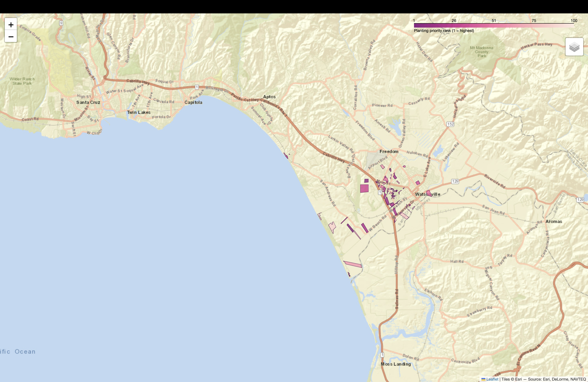

# CanopyRank

**Open-source, parcel-level urban heat prioritization.**

CanopyRank turns public satellite, canopy, and parcel data into a ranked list of *where to plant trees next* — down to individual lots, not census tracts. Built for city foresters, urban planners, and environmental justice organizations who need an actionable list, not another heat map.

> Most urban heat island tools stop at 30m raster resolution or census-tract granularity. CanopyRank downscales to the parcel level and ranks sites by heat-reduction potential, environmental-justice priority, and feasibility — using only free, public data sources.

---

## Why

Cities and counties routinely pay consultants for heat-vulnerability studies that produce PDFs, not pipelines. Meanwhile the underlying data — Landsat thermal imagery, canopy cover, parcel boundaries, EJ screening indices — is public and free. CanopyRank is the missing glue: an open, reproducible pipeline from raw public data to a ranked, mappable planting list.

## Features

- **Parcel-level downscaling** — regresses coarse (30m) land surface temperature against fine-grained canopy/impervious/building features to estimate heat at the individual parcel level
- **EJ-weighted ranking** — combines predicted heat-reduction potential with CalEnviroScreen / EPA EJScreen priority scores
- **Feasibility filtering** — flags parcels by ownership type (public land, vacant lot, right-of-way) so output is actionable, not theoretical
- **Fully open data stack** — Landsat/ECOSTRESS (Earth Engine), NLCD or county LiDAR canopy, county assessor parcels, CalEnviroScreen/EJScreen
- **Exportable output** — ranked parcels as GeoJSON, viewable in any GIS tool or as an interactive Folium map

## Architecture

```
Raw public data → Zonal stats per parcel → Downscaling model → EJ-weighted ranking → GeoJSON / map
```

| Stage | Library | Input | Output |
|---|---|---|---|
| Ingest | `earthengine-api` | Landsat thermal band | Cloud-masked LST composite |
| Ingest | `geopandas` | County parcel shapefiles | Cleaned parcel geometries |
| Features | `rasterstats` | LST + canopy rasters | Per-parcel zonal statistics |
| Model | `xgboost` | Feature table | Predicted parcel-level LST |
| Ranking | `pandas` | Predictions + EJ index | Ranked parcel list |
| Output | `folium` | Ranked GeoJSON | Interactive map |

## Installation

```bash
git clone https://github.com/bitsbard/canopyrank.git
cd canopyrank

python3 -m venv path/to/venv
source path/to/venv/bin/activate
python3 -m pip install -r requirements.txt
```

### Earth Engine setup

CanopyRank pulls Landsat imagery via Google Earth Engine, which requires a one-time setup:

1. Create a free [Google Cloud project](https://console.cloud.google.com/) (or use an existing one).
2. Register that project for Earth Engine access at [code.earthengine.google.com](https://code.earthengine.google.com/).
3. Authenticate locally:
   ```bash
   earthengine authenticate
   ```
4. Point CanopyRank at your GCP project:
   ```bash
   export EE_PROJECT=your-gcp-project-id
   ```

## Quick Start

**1. Ingest — pull all data sources**

```bash
python src/ingest/fetch_parcels.py --region config/santa_cruz.yaml
python src/ingest/fetch_landsat.py --region config/santa_cruz.yaml
python src/ingest/fetch_canopy.py --region config/santa_cruz.yaml
```

CalEnviroScreen requires a manual download (see [Data Sources](#data-sources) below) before running:

```bash
python src/ingest/fetch_calenviroscreen.py --region config/santa_cruz.yaml
```

**2. Features — zonal stats + combined feature table**

```bash
python src/features/zonal_stats.py --region config/santa_cruz.yaml
python src/features/build_feature_table.py --region config/santa_cruz.yaml
```

**3. Model — train, downscale, rank**

```bash
python src/model/train.py
python src/model/rank_parcels.py --top-n 100
```

**4. Output — generate and view the interactive map**

```bash
python src/viz/map_output.py --input outputs/ranked_parcels.geojson
open outputs/ranked_parcels_map.html
```

Output: `outputs/ranked_parcels.geojson` and an interactive HTML map of the top-ranked planting sites.

## Data Sources

All data sources used are free and public:

- Landsat 8/9 via Google Earth Engine
- NLCD Land Cover (fallback canopy data)
- County LiDAR canopy layers
- County assessor parcel boundaries
- CalEnviroScreen / EPA EJScreen

### CalEnviroScreen — manual download required

California's data portal (`data.ca.gov`) blocks automated/scripted downloads of the CalEnviroScreen shapefile. Download it manually before running `fetch_calenviroscreen.py`:

1. Download the shapefile in your browser from [data.ca.gov](https://data.ca.gov/dataset/11eb2b90-f3c1-46b4-bdf2-ba1dab939dac/resource/8e6a8be3-bfc6-4592-b0c3-7aafd77bba2e/download/calenviroscreen40shp_f_2021.shp.zip).
2. Place the file at `data/raw/calenviroscreen4.zip`.
3. Run the script as normal:
   ```bash
   python src/ingest/fetch_calenviroscreen.py --region config/santa_cruz.yaml
   ```
   It will detect the local file and skip the download step.

## Example Output — Santa Cruz County, CA



Top-100 ranked parcels using the included `config/santa_cruz.yaml` template.

**Model performance:** spatial hold-out R² of **0.74** predicting parcel-level land surface temperature from canopy and impervious cover. Feature importances: impervious surface (0.61), canopy cover (0.35), parcel area (0.04) — directionally as expected, with paved surface dominating the heat signal.

**Finding:** the top-100 ranked parcels concentrate heavily in **Watsonville** (81 of 100), rather than spreading evenly across the county. This tracks with Watsonville's documented CalEnviroScreen burden — it holds some of the county's highest environmental-justice percentiles, and the ranking formula weights EJ priority alongside predicted heat-reduction potential. Within that high-priority pool, heat-reduction potential still varies meaningfully (a ~47% range), so the model is discriminating between parcels rather than just reproducing the EJ score.

## Extending to a New Region

CanopyRank is region-agnostic. To run it for a new county, add a config file specifying the boundary, parcel data source, and canopy source — see `config/santa_cruz.yaml` for the template.

## Contributing

Issues and pull requests welcome.

## License

MIT

## Citation

If you use CanopyRank in research or municipal planning work, please cite this repository.

---

Built by [Jared Mills](https://github.com/bitsbard)
